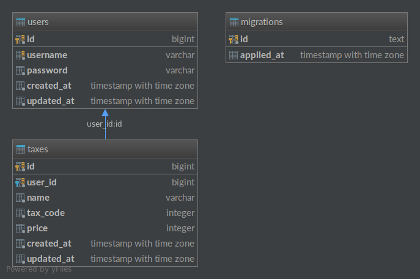

# Database Structure

Here's the database structure for this Back-end application.



## Explanation

### users
```
CREATE TABLE IF NOT EXISTS users (
  "id" BIGSERIAL NOT NULL PRIMARY KEY,
  "username" VARCHAR NOT NULL,
  "password" VARCHAR NOT NULL,
  "created_at" TIMESTAMP WITH TIME ZONE NOT NULL DEFAULT now(),
  "updated_at" TIMESTAMP WITH TIME ZONE NOT NULL DEFAULT now()
);

CREATE UNIQUE INDEX IF NOT EXISTS unique_idx_users_on_username ON users(username);

```

As usual, table `users` is the place to save user's information. Since this is just an example, I just save `username` and `password`. Also, the `id` is a must-have column for all table. I also make the `created_at` and `updated_at` column to record the timestamp when user register or update their profile.

### taxes
```
CREATE TABLE IF NOT EXISTS taxes (
  "id" BIGSERIAL NOT NULL PRIMARY KEY,
  "user_id" BIGINT NOT NULL,
  "name" VARCHAR NOT NULL,
  "tax_code" INTEGER NOT NULL,
  "price" INTEGER NOT NULL CHECK (price >= 0),
  "created_at" TIMESTAMP WITH TIME ZONE NOT NULL DEFAULT now(),
  "updated_at" TIMESTAMP WITH TIME ZONE NOT NULL DEFAULT now()
);

-- add foreign key check
ALTER TABLE taxes ADD CONSTRAINT taxes_user_id_foreign FOREIGN KEY (user_id) REFERENCES users(id) ON DELETE CASCADE ON UPDATE CASCADE;

-- add index for faster query (where user_id = ?)
CREATE INDEX IF NOT EXISTS unique_idx_taxes_on_user_id ON taxes(user_id);
```

`taxes` table save all taxes related to a `user_id`. I only save the `name` which is an item name, `tax_code` and `price`, because the `tax` and `amount` of the tax item must be calculated on the fly. Both, `tax_code` and `price` are in integer data type, since it uses less memory and easy to calculate (we may want to do some math processing in db level in future).

The `price` column using `CHECK` in PostgreSQL to make sure the price is more than 0, since pg don't have unsigned data type.

I also create `created_at` and `updated_at` column to record the row insertion and update timestamp.

### migrations
This table is to record all migration state. I use [https://github.com/rubenv/sql-migrate](https://github.com/rubenv/sql-migrate) for migration. The library will generate SQL which looks like this:

```
CREATE TABLE migrations
(
  id TEXT NOT NULL CONSTRAINT migrations_pkey PRIMARY KEY,
  applied_at TIMESTAMP WITH TIME ZONE
);

```